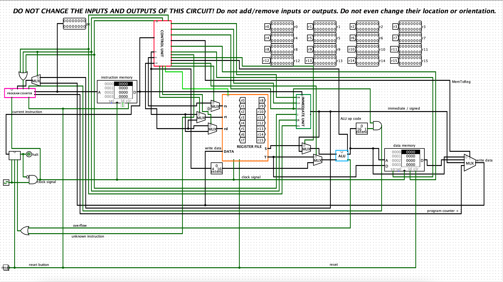

# 16-bit Custom CPU in Logisim

## Overview
This repository contains the design and implementation of a 16-bit CPU in Logisim. The project was developed in three stages, each progressively building on the previous, culminating in a fully functional CPU capable of performing arithmetic, logical, memory, and control-flow operations. The final result demonstrates a complete 16-bit datapath, ALU, memory interface, control unit, and program counter. 

Each project stage includes its own set of exercises, test cases, notes, and reports. The reports are provided in HTML format and offer insights into the thought process, design decisions, and simulations for each phase of development.

**Created for the "Computer Systems & Architecture" 1st bachelor course at the University of Antwerp.**

---


*Figure: Overview of the 16-bit CPU design.*

---

## Key Features
- **Three-Stage Development**: Each stage builds toward the final CPU design.
    - **Project 1**: Focuses on foundational logic, including the creation of basic gates and simple circuits.
    - **Project 2**: Expands to include more complex arithmetic circuits such as adders, and introduces the ALU design.
    - **Project 3**: Completes the CPU by adding the datapath, control unit, and memory access.
- **Arithmetic Logic Unit (ALU)**: Capable of handling operations such as addition, subtraction, AND/OR, shifts, comparisons (less than, greater than), and more.
- **Memory Access**: Load (`lw`) and store (`sw`) operations allow interaction with external memory, mimicking real-world data handling.
- **Branching and Control**: The CPU supports conditional and unconditional jumps for loops and subroutines, enabling flexible program execution.
- **Basic Exception Handling**: Includes mechanisms for detecting arithmetic overflow and invalid instructions.
- **Instruction Set**: A custom instruction set was designed to handle arithmetic, logical, memory, and branching instructions.

## Folder Structure
The project is structured into three main phases, each containing the necessary components, tests, and reports for that stage. Here's the folder breakdown:
```bash
16-bit-custom-CPU-logisim/
├── images/                    # Contains pictures for the README
├── project1/
│   ├── verslag/               # Contains HTML reports for Project 1
│   ├── Week1/                 # Contains exercises and solutions for Week 1
│   ├── Week2/                 # Contains exercises and solutions for Week 2
│   └── Week3/                 # Contains exercises and solutions for Week 3
├── project2/
│   ├── images/                # Project-specific images and diagrams
│   ├── solutions/             # Solutions for exercises in Project 2
│   ├── tests/                 # Test files to verify the Project 2 components
│   └── verslag/               # HTML report detailing Project 2's progress
├── project3/
│   ├── images/                # Project-specific images and diagrams
│   ├── solutions/             # Solutions for exercises in Project 3
│   ├── tests/                 # Test files to verify the final CPU functionality
│   └── verslag/               # HTML report detailing Project 3 and final CPU design
└── README.md                  # Project overview and information
```

## CPU Design Breakdown
The CPU was designed incrementally, with each stage building on the previous one to create a fully functioning processor:

### 1. **Logic Gates and Basic Components**
   - The first step involved designing basic logic gates such as AND, OR, and NOT, as well as components like multiplexers and flip-flops.
   - These were then used to create more complex circuits such as full adders and a 16-bit ripple carry adder.

### 2. **Arithmetic Logic Unit (ALU)**
   - A custom-designed ALU capable of handling a variety of arithmetic and logic operations. The ALU receives a 4-bit operation code that determines the operation to perform on the 16-bit inputs.
   - The ALU is equipped with overflow detection and flags for condition checks (e.g., zero, carry, negative result).

### 3. **Register File**
   - The register file contains sixteen 16-bit general-purpose registers. The register file allows two read operations and one write operation per cycle.
   - Register 0 is hard-wired to zero, and writes to this register are ignored.

### 4. **Memory Operations**
   - Implemented memory access through `load word` and `store word` instructions. This enables the CPU to interact with external data memory.
   - These instructions support memory offsets, which allow access to arrays stored in memory.

### 5. **Program Counter and Control Unit**
   - The program counter advances the instruction address at each clock cycle, unless a branch or jump instruction modifies its value.
   - The control unit interprets the 16-bit instruction and generates control signals for the various components, ensuring that the correct data path is followed during execution.

### 6. **Branching and Control Flow**
   - The CPU supports conditional branching (e.g., branch-if-not-zero) and unconditional jumps, allowing for loops and subroutine calls.
   - Jump and branch instructions modify the program counter to redirect the CPU's execution to another address in memory.

## Instruction Set
The CPU executes a set of custom instructions, including:
- **Arithmetic Operations**:
  - `ADD`: Adds two registers and stores the result.
  - `SUB`: Subtracts one register from another.
  - `INV`: Computes the two's complement (negation) of a register.
  - `SLL`, `SRA`, `SRL`: Shifts a register’s value left or right (arithmetic or logical shifts).
- **Logical Operations**:
  - `AND`, `OR`: Bitwise AND/OR between two registers.
  - `NOT`: Bitwise negation of a register.
- **Memory Access**:
  - `LW`: Loads a word from memory into a register.
  - `SW`: Stores a word from a register into memory.
- **Control Flow**:
  - `BRNZ`: Branch if the value in the register is not zero.
  - `JMP`, `JAL`: Unconditional jump and jump-and-link for subroutine calls.
- **Comparison**:
  - `LT`, `GT`, `EQ`: Compare two registers and store the result (e.g., less than, greater than).

## Example Programs
To demonstrate the CPU’s capabilities, the following example programs were written in assembly:
- **Fibonacci Sequence Generator**: Computes Fibonacci numbers and stores them in memory. Detects when overflow occurs due to exceeding the capacity of a 16-bit word.
- **Sorting Algorithm**: Implements a sorting algorithm (such as bubble sort or quicksort) to sort an array of integers stored in memory.
- **Branching & Loop Example**: Demonstrates how loops and conditional branching are used to iterate over arrays and process data.
